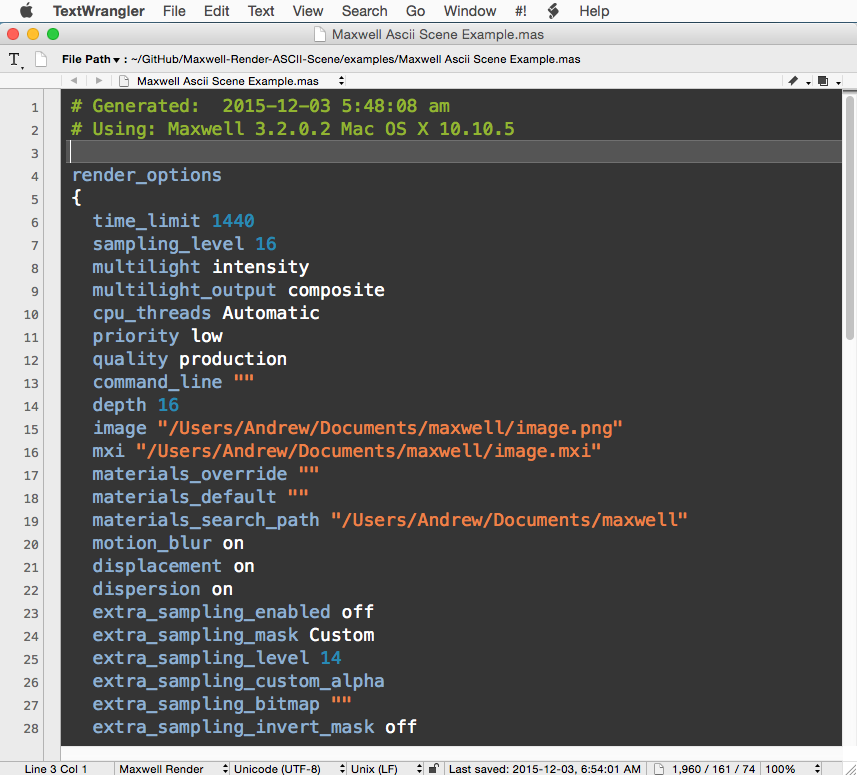

# Maxwell Render ASCII Scene Translator #
**Version 1.0** Released 2015-12-03
by Andrew Hazelden

## Overview ##

The `mxs2ascii` tool will translate a binary format Maxwell Render .mxs scene file into an plain text ASCII format document. There is also a corresponding set of syntax highlighters that make it easier to review and edit this plain text version of a Maxwell Render scene.

Here is an example Maxwell ascii scene file with syntax highlighting enabled:

* * *

I hope this tool improves your coding workflow as you develop new Maxwell Scene files using a plain text editor.

Cheers,  
Andrew Hazelden

Email: [andrew@andrewhazelden.com](mailto:andrew@andrewhazelden.com)   
Blog: [http://www.andrewhazelden.com](http://www.andrewhazelden.com)  
Twitter: [@andrewhazelden](https://twitter.com/andrewhazelden)  
Google+: [https://plus.google.com/+AndrewHazelden](https://plus.google.com/+AndrewHazelden)
