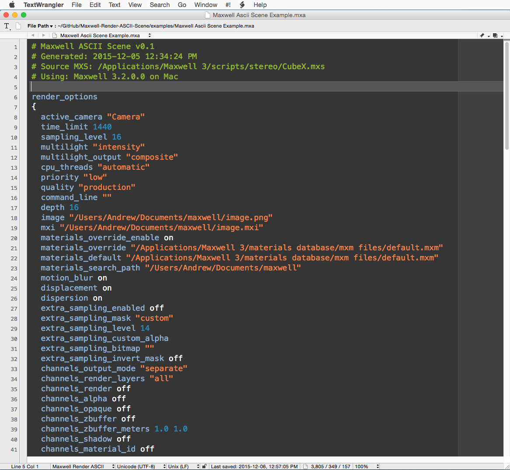
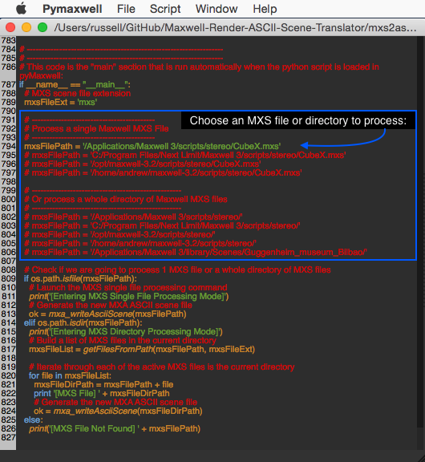
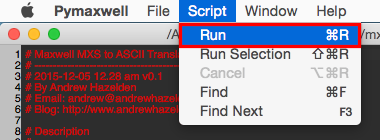

# Maxwell Render ASCII Scene Translator #
**Version 0.1** Released 2015-12-05  
by Andrew Hazelden  

## Overview ##

The `mxs2ascii.py` tool is a new PyMaxwell based python script that will translate a binary format Maxwell Render .mxs scene file into an ASCII plain text format document with the .mxa extension.

There is also a corresponding set of syntax highlighters that are provided with the new toolset. The syntax highlighting modules make it easier to review and edit the new .mxa format scene using one your favorite text editors like Notepad++ (Windows), TextWrangler and BBEdit (Mac), or Gedit (Multi-platform).

Here is an example Maxwell ASCII .mxa scene file with syntax highlighting enabled in TextWrangler:

**Note:** This proof of concept `.mxa` file format for use by rendering TDs is a 3rd party development effort that is being developed independently from Next Limit and the Maxwell Render team. Please don't bother their support department if you have issues with the open source mxs2ascii scene translators and scripts in this repository.

## MXA Development Roadmap ##

### Phase 1 - MXS Binary to MXS ASCII Converter ###
This is the current development stage.

At the present time the `mxs2ascii.py` script is able to successfully translate the input `.mxs` scene file's "Render Options", and "Camera" node information into the new `.mxa` ASCII text format. The development efforts right now are focused on implementing the rest of the data types that are present in a binary format Maxwell Render `.mxs` scene in the `mxs2ascii.py` script.

### Phase 2 - MXA ASCII to MXS Binary Converter ###

This phase will see a matching `ascii2mxs.py` translator script created to convert your .mxa ASCII scene format documents back into the native Maxwell Render .mxa binary format.

### Phase 3 - MXA ASCII Direct to Render ###

Once there is a set of working file translators that can seamlessly translate a scene back and forth between the MXS binary and MXA ASCII file formats, work will start on the final stage 3 effort which is to create a `mxa2render.py` script for directly rendering a .mxa scene file in Maxwell Render.

## Open Source License ##

*The Maxwell Render ASCII Scene Translator is distributed under a GPL v3 license.*

## Script Installation ##

Copy the `mxs2ascii.py` python file to your Maxwell 3.2 scripts directory:

### Windows Script Path ###

    C:/Program Files/Next Limit/Maxwell 3/scripts/

### Linux Script Path ###

    /opt/maxwell-3.2/scripts/
    or
    $home/maxwell-3.2/scripts/

### Mac Script Path ###

    /Applications/Maxwell 3/scripts/

## How do I use the script? ##

**Step 1.** Launch PyMaxwell and open up the `mxs2ascii.py` python script.

**Step 2.** Choose if you want to process a single MXS or a directory filled with of MXS files.

**Process a Single MXS File**

If you want to process a single MXS file edit the "mxsFilePath" variable in the main function near the bottom of this script and specify your Maxwell Studio based MXS scene file.

Then uncomment the code block just below to the section "# Process a single MXS File". Then add python based `#` number sign comments at the beginning of the lines in the "# Or process a whole directory of MXS files" section of code.

**Process a Whole Directory of MXS Files**

If you want to automatically process an entire folder filled with MXS files then you should edit the "mxsDirPath" to specify the folder location that holds your Maxwell Studio based MXS scene files.

Make sure the code block just below to the section "# Process a single MXS File" is commented with python based `#` number sign comments at the beginning of each of the lines.

Then you might need to uncomment the code block lines just below the "# Or process a whole directory of MXS files" section of code.

**Step 3.** Select the **Script > Run** menu item in PyMaxwell.

The script will start running. First the script will verify the mxs scene file exists.

Then the scene will be opened in Maxwell and the scene elements and parameters will be exported to an ASCII text document with the name of `<scene>.mxa`. This new file is saved to the same folder as the original mxs scene file.

Here is a snapshot of the typical console output displayed by the mxs2ascii script in PyMaxwell:

* * *

I hope this tool improves your coding workflow as you develop new Maxwell scene files using a plain text editor.

At this point I find the script is helpful for quickly reviewing all of the active render settings and camera parameters in a Maxwell scene so you can track down any unexpected settings without having to click and scroll through each of the different panels and views in Maxwell Studio.

Cheers,  
Andrew Hazelden

Email: [andrew@andrewhazelden.com](mailto:andrew@andrewhazelden.com)   
Blog: [http://www.andrewhazelden.com](http://www.andrewhazelden.com)  
Twitter: [@andrewhazelden](https://twitter.com/andrewhazelden)  
Google+: [https://plus.google.com/+AndrewHazelden](https://plus.google.com/+AndrewHazelden)
